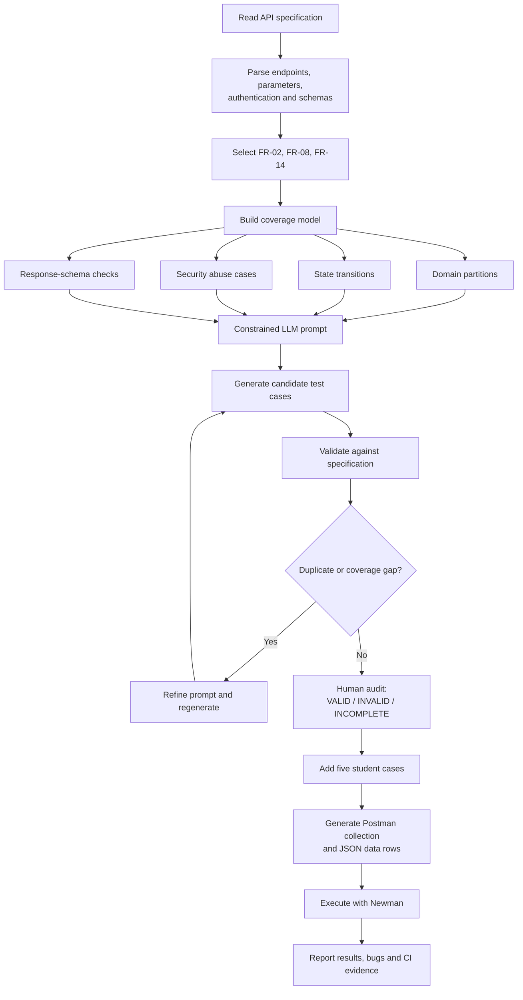

# Generator flow diagram

> Student review note: this Mermaid source is editable. Review the flow, then make at least one design decision or wording change yourself before submission, and record that change in the report.

## Student-owned design choices

- Coverage is planned before the LLM is prompted, so the output can be measured against domain, state, security, and schema requirements.
- Generated cases are not executed automatically until a human audit is completed.
- Bug reports use observed Newman/Postman output only; the generator does not invent execution results.
